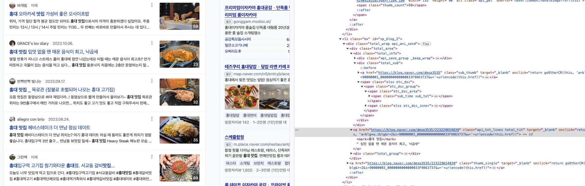
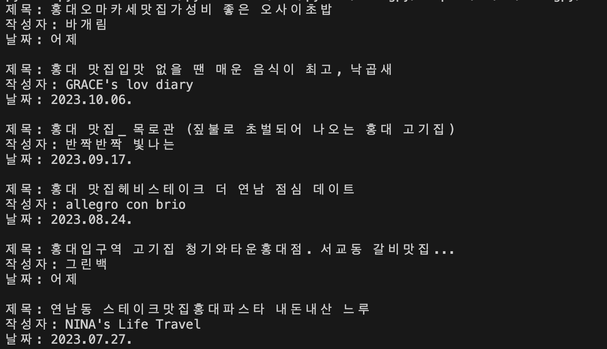

# python-study
파이썬 기본 문법, 크롤링 학습하기
   

### 파이썬 기초 문법
https://software-creator.tistory.com/18

### 파이썬 기초 크롤링
https://software-creator.tistory.com/20   
- 파이썬 라이브러리 설치(request, Beautiful Soup) 
`pip3 install beautifulsoup4 requests`
  
- 네이버 블로그 크롤링 

        soup = BeautifulSoup(response.text, 'html.parser')
        for links in soup.select('ul.lst_total > li.bx'):
            title = links.select('a.api_txt_lines.total_tit') # 블로그 글 제목 크롤링
            title = title[0].get_text(strip=True) # select로 찾은 결과는 리스트로 표시되기에 [0]을 썼습니다. 
            
            print(title)

    